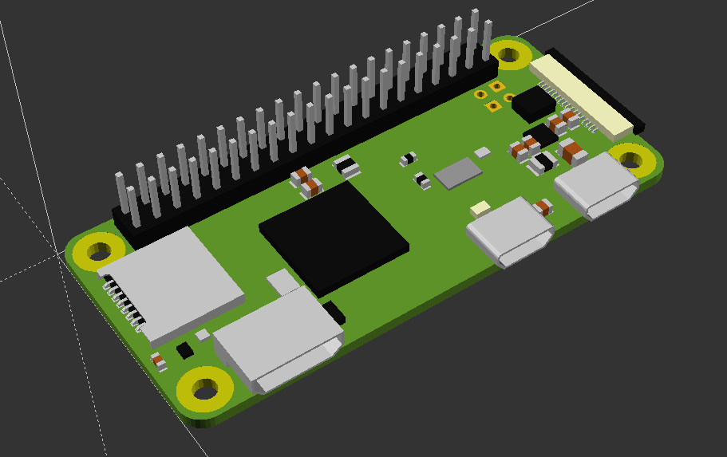

# Raspberry-Pi-SCADs
SCAD models for the raspberry pi, a work in progress.


# Pi Zero

The raspberry pi zero, with or without headers.

```
use <rpi_zero.scad>

pi_zero(with_headers=true, basic=false);
```



